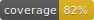

# Discography project Task (Backend)




Welcome to Discography project Task! This project is a Rails API application, focused on managing artists, LPs, and songs, and uses several key technologies and best practices such as caching strategies, serializers, API rate-limiting, Swagger for API documentation, and more.

## Requirements

* Docker
* docker-compose

## Install

**Important** its mandatory start redis server

```bash
git clone git@github.com:soft2help/coditramuntana-task.git
cd coditramuntana-task/backend
bundle install
rails db:drop db:create db:migrate db:seed
cd notes/docker/backend_redis
docker-compose up -d
cd ../../../
rails s -p 3001
````

## DB

Install/reinstall db

from backend root (backend folder)

```bash
rails db:drop db:create db:migrate db:seed
```

## Development

Rubocop, standard and solargraph was used to help in development process using visual code ide

* **rubocop** is a Ruby static code analyzer and formatter based on the community Ruby style guide. It helps enforce coding standards and automatically fix issues in your code.

* **standard** is an alternative to Rubocop with its own opinionated style guide. It's designed to work with less configuration and focus on quick and consistent code formatting.

* **solargraph** is a Ruby language server that provides IDE features like code completion, inline documentation, and type-checking

for more info check Gemfile section **group :development, :test** and files **.rubocop**, **.standard** and **.solargraph**

in .vscode/settings.json are the configuration used to vscode ide

### Code quality, security, and adherence to best practice

Added tools gems standard, bundle-audit and brakeman

* **standard** ensure code style consistency

* **bundle-audit** Checks project's dependencies for known vulnerabilities.

* **brakeman** Scans Rails application for security vulnerabilities.

> [!NOTE]
> if you want to add brakeman exceptions in interactive way use: **bundle exec brakeman -I**

With this tools you can perform commands to ensure code quality

from backend root (backend   folder)

```bash
bundle exec standardrb
bundle exec brakeman -A
bundle exec bundle-audit check --update --config bundler-audit.yml
````

## Redis

We use redis to perform several caching stategies

from backend root (backend   folder)

```bash
cd notes/docker/backend_redis
docker-compose up -d
```

## Testing

from backend root (backend folder)

```bash
bundle exec rspec --format documentation
```

## Swagger

from backend root (backend folder)
to generate swagger api documention use

**SWAGGER_ENV** will produce url for each enmviroment required

```bash
SWAGGER_ENV="development" RSWAG_DRY_RUN=0  rails rswag
```

after start webserver you will available **/api-docs** endpoint where you can test api and check documentation


## Swagger Documentation

In endpoint http://localhost:3001/api-docs

here you can easily test and understand the API's endpoints.

in Authorize button you set an Bearer token.

Generate bearer token

open an rails console
from backend root (backend folder)
```bash
rails c
```

on rails console

```ruby
user = User.create(email: "adminapi@domain.com", password: "AdminApi2024**", roles: [:admin])
api_key = ApiKey.create(bearer: user)
api_key.raw_token
```

copy raw token and past in value input for bearer token, and click authorize

test endpoints

## Topics covered

* Development process
* Database creation
* Database Initialization
* Testing run spec
* Swagger API
* Serializers
* Query Objects
* Endpoints Security
* Middleware Authentication
* JSON API Compliance
* Strong Parameters
* Error Handling
* Pagination
* Security (throttling)
* API Version
* Caching Strategies

